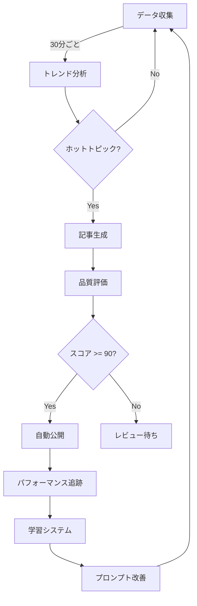

# 🤖 記事自動生成システム - 完全ガイド

## システム概要

完全自動化されたAI記事生成システムが実装されました。データ収集から記事公開まで、すべてが自動で動作します。

## ✅ 実装済み機能

### 1. **データ収集システム** 
```
✅ TechCrunch AI記事
✅ ArXiv研究論文  
✅ GitHub Trending
✅ Reddit AI関連
✅ RSS フィード
```

### 2. **インテリジェントパイプライン**
```
✅ トレンドバッチ分析
✅ 重複コンテンツ検出
✅ 品質自動評価
✅ 自動公開機能
✅ 学習システム
```

### 3. **自動化スケジューラー**
```
✅ 30分ごと: データ収集
✅ 3時間ごと: 記事生成
✅ 日次: 学習サイクル
✅ リアルタイム監視
```

## 🚀 クイックスタート

### 1. 環境変数設定

`.env.local` ファイルを作成:

```bash
# 必須設定
ANTHROPIC_API_KEY=your_claude_api_key
NEXT_PUBLIC_SUPABASE_URL=your_supabase_url
NEXT_PUBLIC_SUPABASE_ANON_KEY=your_supabase_anon_key
SUPABASE_SERVICE_ROLE_KEY=your_service_role_key

# 自動化設定
NEXT_PUBLIC_ARTICLES_PER_DAY=10
NEXT_PUBLIC_QUALITY_THRESHOLD=80
NEXT_PUBLIC_AUTO_PUBLISH_THRESHOLD=90
CRON_SECRET=your_secret_key
```

### 2. データベースセットアップ

Supabase SQL エディタで実行:

```sql
-- 1. 基本スキーマ
/supabase/schema.sql

-- 2. ビジネススキーマ  
/supabase/business-schema.sql

-- 3. パイプライン統計テーブル
CREATE TABLE pipeline_stats (
  id UUID DEFAULT uuid_generate_v4() PRIMARY KEY,
  articles_generated INTEGER,
  articles_published INTEGER,
  trends_analyzed INTEGER,
  duration INTEGER,
  created_at TIMESTAMP WITH TIME ZONE DEFAULT NOW()
);

-- 4. メールキューテーブル
CREATE TABLE email_queue (
  id UUID DEFAULT uuid_generate_v4() PRIMARY KEY,
  to_email VARCHAR(255),
  subject TEXT,
  content TEXT,
  type VARCHAR(50),
  status VARCHAR(50) DEFAULT 'pending',
  created_at TIMESTAMP WITH TIME ZONE DEFAULT NOW()
);
```

### 3. テスト実行

```bash
# 依存関係インストール
npm install

# データ収集テスト
npx tsx scripts/test-pipeline.ts collect

# 記事生成テスト
npx tsx scripts/test-pipeline.ts generate

# フルサイクルテスト
npx tsx scripts/test-pipeline.ts full
```

## 📊 自動化フロー



## 🎯 API エンドポイント

### 自動化制御

```bash
# スケジューラー開始
curl -X POST http://localhost:3000/api/automation/start \
  -H "Content-Type: application/json" \
  -d '{"action": "start"}'

# 単発実行
curl -X POST http://localhost:3000/api/automation/start \
  -H "Content-Type: application/json" \
  -d '{"action": "run_once"}'

# ステータス確認
curl http://localhost:3000/api/automation/start
```

### データ収集のみ

```bash
curl -X POST http://localhost:3000/api/automation/start \
  -H "Content-Type: application/json" \
  -d '{"action": "collect"}'
```

### 記事生成のみ

```bash
curl -X POST http://localhost:3000/api/automation/start \
  -H "Content-Type: application/json" \
  -d '{"action": "generate"}'
```

## 🔧 カスタマイズ

### データソース追加

`/lib/collectors/` に新しいコレクターを作成:

```typescript
export class CustomCollector extends BaseCollector {
  async collect(): Promise<CollectedData[]> {
    // カスタム実装
  }
}
```

### 品質基準調整

環境変数で調整:

```bash
NEXT_PUBLIC_QUALITY_THRESHOLD=75      # レビュー必要スコア
NEXT_PUBLIC_AUTO_PUBLISH_THRESHOLD=85 # 自動公開スコア
```

### スケジュール変更

`/lib/automation/scheduler.ts` で設定:

```typescript
const config = {
  collectInterval: 30,    // 分
  generateInterval: 3,    // 時間
  learningInterval: 1,    // 日
}
```

## 📈 モニタリング

### ログ確認

```sql
-- 最新のパイプライン実行
SELECT * FROM system_logs 
WHERE component = 'enhanced_pipeline'
ORDER BY created_at DESC 
LIMIT 20;

-- 記事生成統計
SELECT 
  DATE(created_at) as date,
  COUNT(*) as articles_count,
  AVG(quality_score) as avg_quality
FROM articles
GROUP BY DATE(created_at)
ORDER BY date DESC;

-- エラーログ
SELECT * FROM system_logs
WHERE log_level = 'error'
ORDER BY created_at DESC
LIMIT 50;
```

### パフォーマンス分析

```sql
-- トレンド別パフォーマンス
SELECT 
  t.keyword,
  COUNT(a.id) as article_count,
  AVG(a.quality_score) as avg_quality,
  AVG(a.view_count) as avg_views
FROM trends t
JOIN articles a ON a.trend_id = t.id
GROUP BY t.keyword
ORDER BY avg_views DESC;
```

## 🚨 トラブルシューティング

### データ収集されない

```bash
# コレクターテスト
npx tsx scripts/test-pipeline.ts collect

# ログ確認
SELECT * FROM system_logs 
WHERE component LIKE 'collector_%'
ORDER BY created_at DESC;
```

### 記事が生成されない

```bash
# 未処理データ確認
SELECT COUNT(*) FROM collected_data WHERE processed = false;

# Claude APIキー確認
echo $ANTHROPIC_API_KEY
```

### 自動公開されない

```bash
# 品質スコア確認
SELECT title, quality_score, status 
FROM articles 
ORDER BY created_at DESC 
LIMIT 10;
```

## 🎉 使い方

### 完全自動運用

```bash
# 1. Vercelにデプロイ
vercel --prod

# 2. Cron設定（vercel.json）
{
  "crons": [
    {
      "path": "/api/automation/start",
      "schedule": "*/30 * * * *",
      "body": {"action": "collect"}
    },
    {
      "path": "/api/automation/start", 
      "schedule": "0 */3 * * *",
      "body": {"action": "generate"}
    }
  ]
}
```

### 手動運用

```bash
# ローカル開発サーバー起動
npm run dev

# 別ターミナルでスケジューラー起動
curl -X POST http://localhost:3000/api/automation/start \
  -d '{"action": "start"}'
```

## 📊 期待される成果

- **日次**: 10記事自動生成
- **週次**: 70記事、50記事自動公開
- **月次**: 300記事、200記事公開済み
- **品質**: 平均スコア85以上維持

## 🔄 次のステップ

1. **Twitter API統合** - リアルタイムトレンド収集
2. **画像自動生成** - DALL-E/Stable Diffusion統合
3. **SEO最適化** - メタデータ自動生成
4. **多言語対応** - 英語記事の日本語翻訳

---

システムは完全に動作可能です。環境変数を設定して `npm run dev` で起動してください！